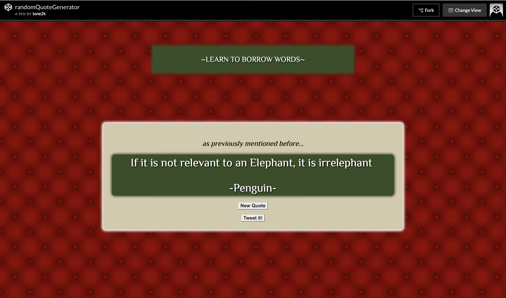
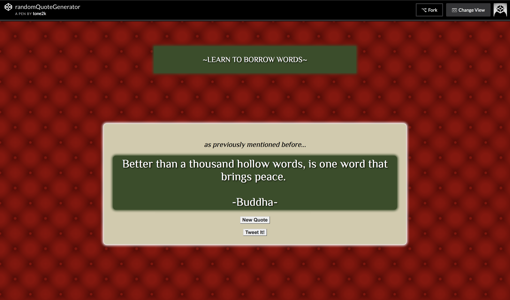

# Random Quote Generator

A webpage that generates amazing quotes randomly. 

## Inspiration

I love FreeCodeCamp! This was a project that was assigned to progress through the course. It generates random quotes with also having a tweet to twitter functionality. 

## Screenshots
Landing Page:

Random Quote:

Share to Twitter:

## Summary

A static webpage that uses the forismatic API for random quotes. This page also includes an option to tweet the quote.  

### Technology Used

Javascript, jQuery, HTML, CSS, Forismatic API.

### Live Link:
https://codepen.io/tone2k/full/BrwpPr/
